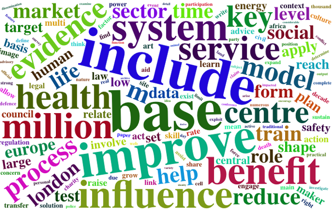

<!-- PROJECT LOGO -->
<br />
<div align="center">
  <a href="https://github.com/QianZhang19/SDG-mapping-tool">
    
  </a>

<h3 align="center">SDG Mapping Tool</h3>
</div>

## About The Project

The SDG (Sustainable Development Goals) mapping tool is a tool used to track and monitor the progress of the 17 SDGs set by the United Nations. The tool helps organizations and governments understand how their actions and initiatives align with the SDGs and identifies areas where they can make a greater impact

<p align="right">(<a href="#readme-top">back to top</a>)</p>

### Built With

* R
* R Studio

<p align="right">(<a href="#readme-top">back to top</a>)</p>

## Getting Started

1. Install R and R Studio
2. Clone the repo
   ```sh
   git clone https://github.com/QianZhang19/SDG-mapping-tool.git
   ```
3. Install libraries
   ```sh
   install.packages("PACKAGENAME")
   ```
<p align="right">(<a href="#readme-top">back to top</a>)</p>

## Usage
* Alignment assessment: The tool helps organizations understand how their actions and initiatives align with the SDGs and identifies areas where they can make a greater impact.

* Stakeholder engagement: The tool can be used to engage stakeholders and gather data on the organization's impact on the SDGs.

* Progress tracking: The tool helps organizations track their progress towards achieving the SDGs and identify areas for improvement.

* Reporting: The tool can be used to generate sustainability reports that communicate an organization's impact on the SDGs to stakeholders.

* Collaboration: The tool can be used to identify opportunities for collaboration with other organizations and stakeholders to achieve the SDGs.

* Decision-making: The tool provides data that can be used to inform decision-making processes related to sustainability and the SDGs.

## Roadmap

- Data washing for the input documents (retain the main words in each document)
  
- Collection of the corpus for the words include the keywords of SDGs and each main word in the documents
  
- Creation of the matrix for the corpus and the input documents (rows of the matrix are documents and each SDG; columns of the matrix is words of them)
  
- Calculation of the mean value for each row (get the centre of the input document)
  
- Distance measurement between each SDG and each document
  
- Selection of the closer distance as mapping results

## Contributing

Contributions are what make the open source community such an amazing place to learn, inspire, and create. Any contributions you make are **greatly appreciated**.

If you have a suggestion that would make this better, please fork the repo and create a pull request. You can also simply open an issue with the tag "enhancement".
Don't forget to give the project a star! Thanks again!

1. Fork the Project
2. Create your Feature Branch (`git checkout -b feature/AmazingFeature`)
3. Commit your Changes (`git commit -m 'Add some AmazingFeature'`)
4. Push to the Branch (`git push origin feature/AmazingFeature`)
5. Open a Pull Request

## License

Distributed under the MIT License. See `LICENSE.txt` for more information.

## Contact

Your Name - [@QianZhang] - qianzhang019@gamil.com

Project Link: [https://github.com/QianZhang19/SDG-mapping-tool](https://github.com/QianZhang19/SDG-mapping-tool)

## Acknowledgments

* Professor Jeremy Levesley
* Dr Seyedeh Zahra Rezaei Lalami	
* Ms Asha Mistry
